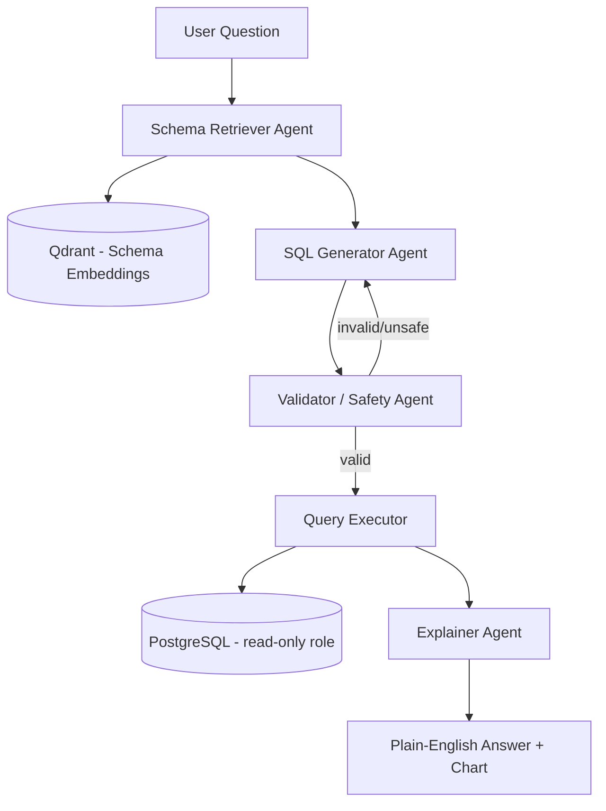

# Architecture

```mermaid
flowchart TD
    A[User Question] --> B[Schema Retriever Agent]
    B --> C[(Qdrant - Schema Embeddings)]
    B --> D[SQL Generator Agent]
    D --> E[Validator / Safety Agent]
    E -- invalid/unsafe --> D
    E -- valid --> F[Query Executor]
    F --> G[(PostgreSQL - read-only role)]
    F --> H[Explainer Agent]
    H --> I[Plain-English Answer + Chart]
```

See the full project blueprint doc for database design, API design, and security details.
